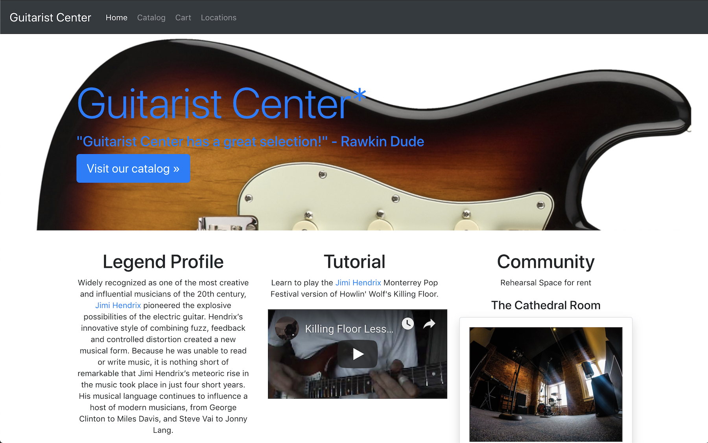

# React JS Store with Shopping Cart

This project was for the Full Stack Developer bootcamp I did and was for a lesson on React events.

## The Assignment
> * Create a menu component for the website for the fictitious company you have been working on in the last task. This component should include a menu item that allows a user to view and change their profile. The component should also include a menu item that allows the user to “shop” and a menu item to return to the homepage.
> * Modify the App.js file you created in your previous task to do the following:
>
> > * Display the header component on every page.
> > * Display the menu component on every page. The menu component should only display relevant items. For example, if the user is on the “shop” page, the “shop” menu item should no longer be displayed.
> > * Only display the landing component on the home page (i.e. root URL - “/”)
> > * Display at least 3 product components when the “shop” menu item is selected.

## Demo
I have the code hosted for demo at Heroku. It may be a little slow to spin up but you can [check it out here](https://dh4u-bootcamp-guitar-store-v3.herokuapp.com/).

## Running the Code

[Clone / Download](https://github.com/dh4u/bootcamp-guitar-store) the project to your computer.

### Start the code
Open command prompt / terminal for the project folder and then you can run:

#### `npm install`

This will install the node dependencies.

#### `npm start`

Runs the app in the development mode. 
Open [http://localhost:3000](http://localhost:3000) to view it in the browser.
***
###### This project was bootstrapped with [Create React App](https://github.com/facebook/create-react-app).